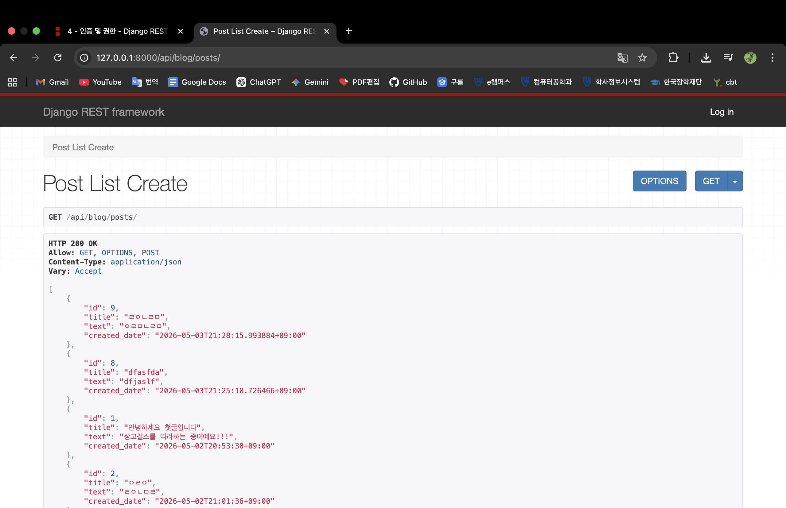

# 장고를 배워보자!

```jsx
나는 Mac 환경에서 이번에 Django를 배우기로 했다
```

[https://jeffkit.gitbooks.io/django-girls-tutorial/content/ko/](https://jeffkit.gitbooks.io/django-girls-tutorial/content/ko/)

```jsx
나는 이 링크를 통해 장고걸스 튜토리얼을 진행하였다 들어가서 참고하면 좋겠다.
```

### 환경설정 : 파이썬 설치

```jsx
맥 환경에서는 pyenv라는 것을 활용해 폴더마다 파이썬 버전을 바꾸어 개발이 편리한것이 있다는걸 알았다

따라서 홈브루를 통해 pyenv를 설치하며 시작해보겠다
```

터미널을 켜서 입력해보자 → 특정 폴더에서 파이썬 버전을 바꾸고 싶다면 local로 필요버전으로 바꾸자!

```jsx
brew install pyenv # pyenv 설치

echo 'export PYENV_ROOT="$HOME/.pyenv"' >> ~/.zshrc # 패스설정?
echo 'export PATH="$PYENV_ROOT/bin:$PATH"' >> ~/.zshrc
echo 'eval "$(pyenv init -)"' >> ~/.zshrc
source ~/.zshrc

pyenv install --list | grep "^\s*3\."  # 버전 목록 확인
pyenv install 3.13.3                    # 최신버전 설치

pyenv global 3.13.3                     # 기본으로 설정

python --version
```

### 시작하기 : 장고걸스 튜토리얼에 관하여

```jsx
나는 장고걸스 튜토리얼이라는 초보자 입문 코스로 진행해 볼겠다. 
나는 장고라는 것이 무엇인지 확실히 모른다 웹을 만들기위한 파이썬을 활용한 웹프레임워크라는 정도만 알고있다. 
이번 튜토리얼을 통해 나는 장고가 무엇인지 알고 기본적인 구조와 문법 가장 간단한 웹을 만들수있는 기초를 얻으면 좋겠다.
시작하겠다.
```

#### 장고걸스 튜토리얼 따라하기

(1. 설치하기. 까지 내용이다.)

1. 가상환경 만들기 → 가상환경을 만들지 않는다면 pip install을 통해 global(내 Mac 전체에)로 장고/파이썬 버전이 통일되어버려서 여러 웹사이트에서 버전을 다르게 쓴다면, 관리가 어렵다
    
    
    따라서 프로젝트 폴더안에 가상환경 폴더를 넣어서 분리시킨다
    
    Example → 폴더 구조 예시
    
    ```jsx
    장고 공부
    	 |--   내 가상환경 폴더        # 가상환경 (여기 안에 파이썬, pip, 패키지 다 들어있음)
    ```
    
    해보자!  자기 프로젝트 폴더를 하나 만든뒤 그 폴더안에서 터미널을 켜서 시작한다!
    
    ```jsx
    python3 -m venv myvenv #myvenv라는 가상환경을 만든다 -m이 make 만들기 옵션인듯
    
    source myvenv/bin/activate #bin으로 실행파일안에 activate라는 가상환경 실행 버튼이 있는듯(매 터미널을 열때마다 실행해줘야하긴함)
    
    (myvenv) unknownname@MacBookAir ~ % #(myvenv)라는것이 뜨면 성공!!!
    
    pip install django #pip파이썬 패키지 관리자(설치담당)를 통해 장고 설치
    
    deactivate #가상환경 끄기(참고), 잘안씀 터미널창 닫고 다시켜면되서 
    ```
    
    @참고 : 가상머신 vs 가상환경 → 가상머신: 다른 운영체제, 다른 컴퓨터 / 가상환경: 다른 버전(프로그램?), 같은컴퓨터 
    

(2. 인터넷은 어떻게 동작할까요? 까지의 내용이다.)

1. 장고가 하는일에 대하여
    
    밑의 글을 읽고 장고 = 서버에 필요한것(DB에서 정보를 조회하려할때 사람의 쿠키값, 요청에 따라 다른걸 진행한다)이다, 정도로 이해했다.
    
    ```jsx
    장고 튜토리얼을 시작할 때부터, 장고가 무슨 일을 하는지 궁금하셨죠? 
    여러분이 답장을 보낼 때, 모든 사람에게 항상 동일한 내용을 보내고 싶지 않을 거에요. 
    받는 사람에 따라 각각 다른 답장을 보내면 더 좋지 않을까요? 
    이와 같이 장고는 맞춤형 편지를 보낼 수 있도록 도와준답니다. :) -> 장고걸스에 적혀있는 내용을 발췌하였다
    ```
    
2. 내가 누구일까요? Who am i? 입력해보기
    
    whoami라는 명령어를 치면 현재 컴퓨터 사용잔의 이름이 뜬다 → 조금 신기한듯 좋네
    
    ```jsx
    (myvenv) unknownname@hwangdaegyeom-ui-MacBookAir 장고 공부 % whoami
    unknownname
    ```
    
3. 경로 확인하기. pwd로 내 현재 위치 알기
    
    ```jsx
    (myvenv) unknownname@hwangdaegyeom-ui-MacBookAir 장고 공부 % pwd
    /Users/unknownname/Documents/장고 공부
    ```
    
4. 파일 리스트 보기 → ls 이건 귀찮아서 패스 + 파일 복사 cp 옮길곳파일경로 줄곳파일경로 / 파일 위치 옮기기 mv 옮길곳파일경로 줄곳파일경로
5. 경로 변경 → cd (pwd로 확인한 경로/ ..) 이런거 평소좀 적어서 귀찮아서 패스
    
    ```jsx
    (myvenv) unknownname@hwangdaegyeom-ui-MacBookAir 장고 공부 % cd myvenv
    (myvenv) unknownname@hwangdaegyeom-ui-MacBookAir myvenv % ls
    bin             include         lib             pyvenv.cfg
    
    #참고 myvenv안에는 pyenv로 설치한 파이썬의 설정파일과 가상환경실행때 사용한 bin폴더, 기타 등등이 존재한다
    ```
    
6. 폴더 만들기 → mkdir로 폴더 추가하기(클릭으로 생성하는것도 좋지만 해보는게 좋음)
    
    ```jsx
    (myvenv) unknownname@hwangdaegyeom-ui-MacBookAir 장고 공부 % mkdir domakedirectory
    (myvenv) unknownname@hwangdaegyeom-ui-MacBookAir 장고 공부 % ls
    domakedirectory myvenv
    
    #참고 아까만들었던 가상환경또한 폴더라 폴더는 2개가 존재한다
    ```
    
7. 폴더 삭제하기
    
    ```jsx
    rm 파일(디렉토리) : 삭제 remove
    rm -r 폴더 : 하위폴더 안 내용물까지 전부 삭제 (재귀적으로, recusive)
    rm -f 폴더 : 확인 없이 강제 삭제 force
    rm -rf 폴더 : 폴더째로 강제 삭제 recusive force
    ```
    
    ```jsx
    (myvenv) unknownname@hwangdaegyeom-ui-MacBookAir myvenv % cd .. #상대경로 지금위치 바로 위로
    (myvenv) unknownname@hwangdaegyeom-ui-MacBookAir 장고 공부 % ls
    domakedirectory myvenv
    (myvenv) unknownname@hwangdaegyeom-ui-MacBookAir 장고 공부 % rm -r domakedirectory
    (myvenv) unknownname@hwangdaegyeom-ui-MacBookAir 장고 공부 % ls
    myvenv
    ```
    

(3. Command Line 시작하기. 까지 내용이다.)

1. 터미널창 간지나게 닫기 → exit(해커처럼 멋지게 클릭안하고 끄는법이다 → 좀 멋진듯)
    
    ```jsx
    (myvenv) unknownname@hwangdaegyeom-ui-MacBookAir 장고 공부 % exit # 당황하지말자 당시은 터미널창을 끈것이다
    
    ```
    

(6. Python 시작하기. 까지 내용이다.)

1. 파이썬 기본 문법 → if의 경우 : 뒤를 비우면 Syntax Error가 발생한다.
    
    ```jsx
    if 3 > 2:    #이것만 적으면 if문이 완결되지않았기에 뭐라도 적어야하는듯
    
    # 실행 시, 오류화면
    $ python3 python_intro.py
    File "python_intro.py", line 2
             ^
    SyntaxError: unexpected EOF while parsing
    
    # --->
     if 3 > 2:
            print('It works!')  #이런식으로 if문을 적었다면 안에 실행문을 무조건 적는것이 문법인듯
    ```
    

11. 장고란?

```jsx
Web Server : http request -> 해당 port에 request가 실제 있는지 확인하는 역할
-> request
Django :  Webserver에서 들고온 request -> Django 내부 unresolver가 URL pattern에 매칭 ->
패턴에 맞는 함수(view)에게 넘김 -> view 함수가 DB 조회,처리 후 response를 생서하여 반환 
-> response
Web browser : Django의 view 함수에게 반환받은 response를 수신함
```

1. 장고 기본 프로젝트 만들기 → 장고 관리자 권한으로 프로젝트를 이 폴더에서 시작함
    
    ```jsx
    (myvenv) unknownname@hwangdaegyeom-ui-MacBookAir 장고 공부 % django-admin startproject mysite .
    (myvenv) unknownname@hwangdaegyeom-ui-MacBookAir 장고 공부 % ls
    manage.py       mysite          myvenv
    (myvenv) unknownname@hwangdaegyeom-ui-MacBookAir 장고 공부 % cd mysite
    (myvenv) unknownname@hwangdaegyeom-ui-MacBookAir mysite % ls
    __init__.py     asgi.py         settings.py     urls.py         wsgi.py
    ```
    
    ```jsx
    장고 공부
    ├───myvenv #기존에 있던 가상환경
    ├───manage.py #기존에 있던 가상환경 관련 python파일
    └───mysite #새로만들어진 Django 프로젝트 파일
            settings.py
            urls.py
            wsgi.py
            __init__.py
    ```
    
    [manage.py](http://manage.py) → 장고 명령어들을 쓸수있게 만들어 주는 파이썬 파일 (runserver(장고 서버 실행), migrate(DB table 만드는 명령어))
    
    ```python
    #!/usr/bin/env python
    """Django's command-line utility for administrative tasks."""
    import os
    import sys
    
    def main():
        """Run administrative tasks."""
        os.environ.setdefault('DJANGO_SETTINGS_MODULE', 'mysite.settings')
        try:
            from django.core.management import execute_from_command_line
        except ImportError as exc:
            raise ImportError(
                "Couldn't import Django. Are you sure it's installed and "
                "available on your PYTHONPATH environment variable? Did you "
                "forget to activate a virtual environment?"
            ) from exc
        execute_from_command_line(sys.argv)
    
    if __name__ == '__main__':
        main()
    ```
    
2. 웹사이트 설정하기
    
    ```python
    mysite/settings.py → 시간대 한국으로 변경하기
    
    + css를 위해 STATIC_ROOT = BASE_DIR / 'static' 추가하기
    ```
    



settings.py

```python
"""
Django settings for mysite project.

Generated by 'django-admin startproject' using Django 6.0.4.

For more information on this file, see
https://docs.djangoproject.com/en/6.0/topics/settings/

For the full list of settings and their values, see
https://docs.djangoproject.com/en/6.0/ref/settings/
"""

from pathlib import Path

# Build paths inside the project like this: BASE_DIR / 'subdir'.
BASE_DIR = Path(__file__).resolve().parent.parent

# Quick-start development settings - unsuitable for production
# See https://docs.djangoproject.com/en/6.0/howto/deployment/checklist/

# SECURITY WARNING: keep the secret key used in production secret!
SECRET_KEY = 'django-insecure-p+^&3j*cy__e$7g7e&)18b+5or@mda(tw(3-9&k=%)2=al8!)!'

# SECURITY WARNING: don't run with debug turned on in production!
DEBUG = True

ALLOWED_HOSTS = []

# Application definition

INSTALLED_APPS = [
    'django.contrib.admin',
    'django.contrib.auth',
    'django.contrib.contenttypes',
    'django.contrib.sessions',
    'django.contrib.messages',
    'django.contrib.staticfiles',
]

MIDDLEWARE = [
    'django.middleware.security.SecurityMiddleware',
    'django.contrib.sessions.middleware.SessionMiddleware',
    'django.middleware.common.CommonMiddleware',
    'django.middleware.csrf.CsrfViewMiddleware',
    'django.contrib.auth.middleware.AuthenticationMiddleware',
    'django.contrib.messages.middleware.MessageMiddleware',
    'django.middleware.clickjacking.XFrameOptionsMiddleware',
]

ROOT_URLCONF = 'mysite.urls'

TEMPLATES = [
    {
        'BACKEND': 'django.template.backends.django.DjangoTemplates',
        'DIRS': [],
        'APP_DIRS': True,
        'OPTIONS': {
            'context_processors': [
                'django.template.context_processors.request',
                'django.contrib.auth.context_processors.auth',
                'django.contrib.messages.context_processors.messages',
            ],
        },
    },
]

WSGI_APPLICATION = 'mysite.wsgi.application'

# Database
# https://docs.djangoproject.com/en/6.0/ref/settings/#databases

DATABASES = {
    'default': {
        'ENGINE': 'django.db.backends.sqlite3',
        'NAME': BASE_DIR / 'db.sqlite3',
    }
}

# Password validation
# https://docs.djangoproject.com/en/6.0/ref/settings/#auth-password-validators

AUTH_PASSWORD_VALIDATORS = [
    {
        'NAME': 'django.contrib.auth.password_validation.UserAttributeSimilarityValidator',
    },
    {
        'NAME': 'django.contrib.auth.password_validation.MinimumLengthValidator',
    },
    {
        'NAME': 'django.contrib.auth.password_validation.CommonPasswordValidator',
    },
    {
        'NAME': 'django.contrib.auth.password_validation.NumericPasswordValidator',
    },
]

# Internationalization
# https://docs.djangoproject.com/en/6.0/topics/i18n/

LANGUAGE_CODE = 'en-us'

TIME_ZONE = 'Asia/Seoul' #여기를 서울로 바꿔주자!!

USE_I18N = True

USE_TZ = True

# Static files (CSS, JavaScript, Images)
# https://docs.djangoproject.com/en/6.0/howto/static-files/

STATIC_URL = 'static/'
STATIC_ROOT = BASE_DIR / 'static' # 향후 css를 입히기?위해 여기도 바꿔주자!! 배포할때 파일을 모아두는 위치
```

데이터 베이스 테이블? 만들기

```python
(myvenv) unknownname@hwangdaegyeom-ui-MacBookAir 장고 공부 % python manage.py migrate
Operations to perform:
  Apply all migrations: admin, auth, contenttypes, sessions
Running migrations:
  Applying contenttypes.0001_initial... OK
  Applying auth.0001_initial... OK
  Applying admin.0001_initial... OK
  Applying admin.0002_logentry_remove_auto_add... OK
  Applying admin.0003_logentry_add_action_flag_choices... OK
  Applying contenttypes.0002_remove_content_type_name... OK
  Applying auth.0002_alter_permission_name_max_length... OK
  Applying auth.0003_alter_user_email_max_length... OK
  Applying auth.0004_alter_user_username_opts... OK
  Applying auth.0005_alter_user_last_login_null... OK
  Applying auth.0006_require_contenttypes_0002... OK
  Applying auth.0007_alter_validators_add_error_messages... OK
  Applying auth.0008_alter_user_username_max_length... OK
  Applying auth.0009_alter_user_last_name_max_length... OK
  Applying auth.0010_alter_group_name_max_length... OK
  Applying auth.0011_update_proxy_permissions... OK
  Applying auth.0012_alter_user_first_name_max_length... OK
  Applying sessions.0001_initial... OK
```

웹서버 실행하기

```python
(myvenv) unknownname@hwangdaegyeom-ui-MacBookAir 장고 공부 % python manage.py runserver
Watching for file changes with StatReloader
Performing system checks...

System check identified no issues (0 silenced).
May 02, 2026 - 18:49:15
Django version 6.0.4, using settings 'mysite.settings'
Starting development server at http://127.0.0.1:8000/
Quit the server with CONTROL-C. #서버 끄기 컨트롤 c

WARNING: This is a development server. Do not use it in a production setting. Use a production WSGI or ASGI server instead.
For more information on production servers see: https://docs.djangoproject.com/en/6.0/howto/deployment/
```


이 화면이 뜬다면 웹서버는 켜진것이다. 축하한다!! 

1. 블로그 객체 모델링하기
    
    ```python
    Post(블로그 객체)
    --------
    <속성 attribute>
    title(제목)
    text(내용)
    author(작성자)
    created_date(글 작성일)
    published_date(글 게시일)
    
    <행위 method>
    publish()(글 게시하기)
    ```
    
    ```python
    Sqlite(기본 내장 설치 불필요) = 장고의 기본 데이터베이스 어댑터(장고 ↔ **어댑터**(매개체) ↔ 데이터베이스)
    -> 향후 다른 DBMS 설치 가능 (PostgreSQL(psycopg2 설치 필요), MySQL(mysqlclient 설치 필요)
    ```
    
2. 어플리케이션? Application 제작하기
    
    ```python
    (myvenv) unknownname@hwangdaegyeom-ui-MacBookAir 장고 공부 % python manage.py startapp blog
    (myvenv) unknownname@hwangdaegyeom-ui-MacBookAir 장고 공부 % ls
    blog            db.sqlite3      manage.py       mysite          myvenv
    ```
    
    db.sqlite3는 DB 테이블 인듯 → python manage.py migrate를 통해 만들어진 것으로 보임
    
    blog라는 이름으로 Application이 만들어짐
    
    ```python
    장고 공부
    |-- myvenv    #가상환경
    |-- db.squlite3    #DB 테이블
    ├── mysite   #Django 프로젝트 폴더로 지정
    |       __init__.py
    |       settings.py
    |       urls.py
    |       wsgi.py
    ├── manage.py    #Django 명령어 실행을 위한 python 파일
    └── blog    #Django위에 올려질 블로그 프로그램
        ├── migrations
        |       __init__.py
        ├── __init__.py
        ├── admin.py
        ├── models.py
        ├── tests.py
        └── views.py
    ```
    
    Django에 Application등록하기 → mysite안의 settings.py
    
    ```python
    # Application definition
    
    INSTALLED_APPS = [
        'django.contrib.admin',
        'django.contrib.auth',
        'django.contrib.contenttypes',
        'django.contrib.sessions',
        'django.contrib.messages',
        'django.contrib.staticfiles',
        'blog', # 블로그 앱 추가됨!!(마지막 , 붙여도 되고 안붙여도됨/ 붙이는 것이 관례 향후 추가시 용이)
    ]
    ```
    
3. 블로그 객체(클래스) 만들기 
    
    → 모든 Model 객체는 blog라는 폴더 안에 models.py에 선언(적어두기) 해야함
    
    ```python
    from django.db import models
    
    # Create your models here.
    
    from django.utils import timezone # 새롭게 한국 시간대로 설정하기위해 라이브러리 추가
    
    class Post(models.Model):
            author = models.ForeignKey('auth.User', on_delete=models.CASCADE) # 외래키 설정, CASCADE(종속)/글 만든 유저 삭제되면 글도 같이 삭제되기
            title = models.CharField(max_length=200) # 글 제목
            text = models.TextField() # 글 내용
            created_date = models.DateTimeField( #글 작성날짜 현재 시간으로 넣기
                    default=timezone.now)
            published_date = models.DateTimeField( # 글 게시 날짜 비우기 허용 <- 시스템에서 넣어줘서인가?
                    blank=True, null=True)
    
            def publish(self): # 게시날짜 <- publish 함수 실행시점의 시간으로 넣어주기, 레코드? 정보 저장하기
                self.published_date = timezone.now()
                self.save()
    
            def __str__(self): #글 제목 주는(반환하는) 함수?
                return self.title
    ```
    
    이것을 보면 DB는 PK가 필수라고 배웠는데 여기서는 설정하지 않아 궁금하였다 
    
    [https://docs.djangoproject.com/en/1.8/ref/models/fields/#field-types](https://docs.djangoproject.com/en/1.8/ref/models/fields/#field-types)공식 문서를 읽어보니
    
    ```python
    모델의 어떤 필드에도 `primary key = True`를 지정하지 않으면 Django는 자동으로 AutoField기본 키를 저장할 `primary key`를 추가합니다.
    ```
    
    라고 하여 Django가 인덱스용 primary key를 만드는것 같다(정확하지 않음)
    
4. Post 클래스 → DB 테이블로 만들기
    
    ```python
    (myvenv) unknownname@hwangdaegyeom-ui-MacBookAir 장고 공부 % python manage.py makemigrations blog
    Migrations for 'blog':
      blog/migrations/0001_initial.py
        + Create model Post
    ```
    

(10. Django 모델. 까지의 내용이다.)

1. Django에 Post 테이블 등록해주기
    
    ```python
    (myvenv) unknownname@hwangdaegyeom-ui-MacBookAir 장고 공부 % python manage.py migrate blog
    Operations to perform:
      Apply all migrations: blog
    Running migrations:
      Applying blog.0001_initial... OK 
    ```
    
2. Post 테이블 관리하기 → blog/admin.py 파일 내용 추가하기
    
    ```python
    from django.contrib import admin
    
    # Register your models here.
    
    from .models import Post # Post 클래스 가져오기
    
    admin.site.register(Post) #Django의 관리자 페이지에서 Post 클래스를 관리하기 위해 등록하는 과정 -> 슈퍼 유저 계정생성도 필요
    ```
    
    웹 서버 실행 → python manage.py runserver
    
    - 참고 zsh은 z shell(터미널에서 명령어를 입력 받는 프로그램**)**의 약자임
    
    확인하기 → [http://127.0.0.1:8000/admin/](http://127.0.0.1:8000/admin/)
    
    
    
    관리할 테이블에 등록 되었다!!
    
    이제 로그인해서 관리해보자!! → 웹 서버가 실행 중이니 다른 터미널 창을 하나 더 키자!!
    
    ```python
    (myvenv) unknownname@hwangdaegyeom-ui-MacBookAir 장고 공부 % python manage.py createsuperuser
    Username (leave blank to use 'unknownname'):admin 
    Email address: ghkdeorua3461@gmail.com
    Password: 
    Password (again): 
    The password is too similar to the username. # 위험하다고한다
    This password is too short. It must contain at least 8 characters. 
    This password is too common.
    Bypass password validation and create user anyway? [y/N]: y #그냥 무시하고 만들자
    Superuser created successfully.
    ```
    
    
    
    성공적으로 로그인한 모습이다!!
    
3. 글을 올려보자!! → 장고 관리자 페이지(DB 데이터를 GUI(화면)으로 관리 가능)
    
    
    
    
    
    글이 올라갔다!!!
    
    게시글에 작성자를 admin을 설정하지 않고 비우니 글이 올라가지 않았다 → 이것을 허용하려면 blog/models.py에서 author에 아래 인자값들을 True로 주어야한다.
    
    ```python
    null=True -> DB에 null 저장 허용
    blank=True -> 폼에서 빈칸 허용
    ```
    
    몇개만 글을 더 올려보자!!
    
    
    
4. 나만 볼순 없다!! → 배포하기
    
    Pythonanywhere 가입하기 (Beginner 초보자)
    


```python
이후 email로 인증후 -> 화면
```


```python
$배쉬를 클릭해서 들어가보자!!
```


```python
git clone을 통해 Pythonanywhere라는 곳에 내 코드가 저장되어서 다른곳에 있는 서버에 내코드가 올라간것임
```

```python
#local에서 진행할때 했던 일을 반복해주면된다. 
cd Django-Girls-tutorial-follow
python -m venv myvenv #가상 환경 만들기
source myvenv/bin/activate #가상 환경 실행하기
pip install django #장고 설치
python manage.py migrate #DB 만들기
python manage.py createsuperuser #admin은 설정이되지 않는다(이미 있는듯), user로 설정하였다
python manage.py collectstatic # 향후 css/js 파일까지 생성되게 되면 필요함 -> 모아서 그리기? 현재 필요X
# 모두 완료 되었다면 --> 웹 앱 탭으로 이동하자!!
```


```python
# 다음 -> 장고 -> python 3.13.3 선택(local의 프로젝트 폴더의 파이썬 버전을 확인하고 선택!!)
(myvenv) unknownname@hwangdaegyeom-ui-MacBookAir 장고 공부 % python --version
Python 3.13.3
```


```python
다음을 눌러 생성하자!!
```


```python
생성이 완료되었다!! 이제 WSIG 파일을 수정해주자!!

!참고 
	WSIG(파이썬 웹 애플리케이션과 웹 서버간의 통신을 위한 표준 프로토콜)
	사용자 브라우저 → PythonAnywhere(웹서버(Ngix, Apache ...)) → WSGI(Web Server Gateway Interface) → Django(blog 앱) → DB(sqlite3 - 기본내장)
```


```python
아래로 스크롤해서 Code 카테고리 하위 WSGI config 파일에서 링크를 클릭해서 들어가자!!
```


```python
변경 내용 -> mysite를 GitHub 레포 이름으로 변경
향후 css/js만들었을 때를 위한 -> from whitenoise import WhiteNoise 추가
WhiteNoise() 함수를 씌워서 css/js 적용해주기(현재는 없어도됨)
+ 화이트 노이즈가 약간 "배경에서 조용히 깔려서 서비스해주는 것"이라서 프론트엔드 관련 파일이 그렇게 된듯 
```


```python
해당 내용을 save로 저장후 -> 새로고침?(다시로드? 초록버튼)를 누르자!!
```


!! white noise라이브러리 깔아야한다 → pip install로 깔아주자


```python
URL로 접속하였는데 화면이 제대로 뜨지않아 error log를 클릭하여 확인하였다.
다시 bash창을 열어서 깔아주었다 -> 다시 로드(새로고침)해서 확인해보자
```

```python
14:46 ~ $ cd Django-Girls-tutorial-follow #가상환경에 설치해아한다...
source myvenv/bin/activate
pip install whitenoise
Looking in links: /usr/share/pip-wheels
Collecting whitenoise
  Using cached whitenoise-6.12.0-py3-none-any.whl.metadata (3.7 kB)
Using cached whitenoise-6.12.0-py3-none-any.whl (20 kB)
Installing collected packages: whitenoise
Successfully installed whitenoise-6.12.0
(myvenv) 14:51 ~/Django-Girls-tutorial-follow (main)$ 
```


```python
접근 설정해줘야한다 -> 기본은 허용하지 않음 -> ALLOWED_HOSTS = ['ghkdeorua1234.pythonanywhere.com']
허용하는 URL로 바꿔주기

bahs 열기 -> nano(vi 같은 그냥 편집기인듯) mysite/settings.py -> 바꿔주기 -> 다시 로드
```


```python
드디어 성공했다!!!! -> /admin을 붙이면 아까 local에서와 같이 관리자 페이지로 들어가진다.
```

(12. 배포하기. 까지의 내용이다.)

1. 장고의 URL에 대하여 → mysite/urls.py에서 설정
    
    ```python
    장고에서 URL과 일치하는 view를 찾기 위한 패턴들의 집합 -> URLconf (URL configuration)를 사용
    ```
    
    mysite/urls.py 파일 내용
    
    ```python
    """
    URL configuration for mysite project.
    
    The `urlpatterns` list routes URLs to views. For more information please see:
        https://docs.djangoproject.com/en/6.0/topics/http/urls/
    Examples:
    Function views
        1. Add an import:  from my_app import views
        2. Add a URL to urlpatterns:  path('', views.home, name='home')
    Class-based views
        1. Add an import:  from other_app.views import Home
        2. Add a URL to urlpatterns:  path('', Home.as_view(), name='home')
    Including another URLconf
        1. Import the include() function: from django.urls import include, path
        2. Add a URL to urlpatterns:  path('blog/', include('blog.urls'))
    """
    from django.contrib import admin
    from django.urls import path
    from django.urls import re_path, include #blog 앱에서 url들고오도록 추가
    
    urlpatterns = [
        path('admin/', admin.site.urls), #관리자 페이지 URL
        re_path(r'', include('blog.urls')), #blog에서 가져오는 것 추가, r은 정규식 문자때문에 쓰는게 관례(\d, \w)
    ]
    ```
    
    정규 표현식 → URL 패턴 찾기
    
    ```python
    정규 표현식으로 url과 매칭
    
    Example
    http://www.mysite.com/post/12345/ -> ^post/(\d+)/$
    
    ^post/ : post/가 있다
    (\d+) : 숫자(한 개 또는 여러개)가 있다(\이거는 -> d만쓰면 문자 d임 -> \써줘야 decimal 정수임)
    / : /뒤에 문자가 있다(?)
    $ : URL의 끝이 앞에 문자로(/)로 끝나야 매칭될 수 있다(끝을 알리는건가?)
    ```
    
    새로 만들기 → blog/urls.py 파일을 만들어 → 정규표현식으로 url패턴 매칭
    
    ```python
    from django.urls import re_path # url 함수 쓰려고 -> url함수 사라짐 -> re_path함수 사용
    from . import views # 같은 경로의 views.py에 선언되어있는 post_list사용하려고
    
    urlpatterns = [ #url패턴 -> 정규식으로 추가
        re_path(r'^$', views.post_list, name='post_list'), #post_list라는 view에서 실제 url처리
    ]
    ```
    
    ```python
    사용자: ghkdeorua1234.pythonanywhere.com/
                                        ↓ (URL입력 매칭)
    blog/urls.py: r'^$' 매칭(빈문자열만 매칭, ^(시작)/ $(끝))
                                        ↓
    views.post_list() 함수 실행
                                        ↓
    게시물 목록 HTML 렌더링
    ```
    
    여기까지 하면 python manage.py runserver를 실행하여도 터미널에 오류가 발생한다 → 아직 view에 post_list()라는 함수를 정의하지 않아서 그런것이니 당황하지 말자!!
    

(13. Django urls.까지의 내용이다.)

1. View함수를 만들어보자!! → blog/views.py
    
    ```python
    from django.shortcuts import render
    
    # Create your views here.
    def post_list(request):
            return render(request, 'blog/post_list.html', {}) #blog/post_list.html을 렌더함수가 브라우저에 반환해줌
    
    ```
    
    ```python
    view는 어플리케이션의 로직을 넣는 공간이다.(실제 우리가 구현하고싶은 기능인것이다!! 이제야 우리가 만드는 목적이다!!)
    모델(클래스, 객체(테이블))에게서 필요한 정보를 받아와서 템플릿(화면, html?)에 전달하는 역할
    ```
    
    
    
    걱정하지마라!! → 아직 템플릿이 구현이 안되어서 그렇다 webserver는 실행되지 않는가!
    

(Django 뷰 만들기. 까지의 내용이다.)

1. 템플릿 작성하기 → 화면을 만들어보자!!
    
    템플릿이 뭔가? → 양식을 저장한 파일이다.(한글 보고서 양식 생각하면 편할듯)
    
    HTML(HyperText Markup Language)는 뭔가? → 웹 브라우저가 해석할 수 있는 코드(웹 페이지 표현)
    
    ```python
    웹 페이지 간 하이퍼링크(클릭하면 이동하는것)가 포함된 텍스트(나무위키 하위문서, 관련문서 누르면 드가는것)
    HTML은 태그(tag)로 구성
    태그 : <(여는 태그) 로 시작하고 >(닫는 태그) = 마크업 요소(elements)라고 함
    ```
    
    템플릿 폴더 → blog폴더 생성하기(폴더 구조가 복잡 사용하는 관습적인 방법)
    
    ```python
    blog
    └───templates
     └───blog
    ```
    
    ```python
    (myvenv) unknownname@hwangdaegyeom-ui-MacBookAir 장고 공부 % cd blog
    (myvenv) unknownname@hwangdaegyeom-ui-MacBookAir blog % mkdir templates
    (myvenv) unknownname@hwangdaegyeom-ui-MacBookAir blog % ls
    __init__.py     admin.py        migrations      templates       urls.py
    __pycache__     apps.py         models.py       tests.py        views.py
    (myvenv) unknownname@hwangdaegyeom-ui-MacBookAir blog % cd templates
    (myvenv) unknownname@hwangdaegyeom-ui-MacBookAir templates % mkdir blog
    (myvenv) unknownname@hwangdaegyeom-ui-MacBookAir templates % ls
    blog
    ```
    
    
    
    웹서버를 켜서 확인해보자!!
    
    ```python
    (myvenv) unknownname@hwangdaegyeom-ui-MacBookAir 장고 공부 % python manage.py runserver
    ```
    
    
    
    아까와 달리 빈화면이 뜬다!!
    
    ```python
    <html> #html 시작 끝 붙이기 -> 규칙
        <p>와 드디어 된다</p> #p는 문단 태그
        <p>html창이 이렇게 소중한거였구나... 따흐흑...ㅠㅠ</p>
    </html>
    ```
    
    
    
    당신은 드디어 웹페이지를 띄웠다!! 감격스럽지 아니한가!
    
    ```python
    HTML -> head와 body로 구분
    head : 문서 정보, 웹 페이지에서 보이지 않음 -> 브라우저에 페이지에 대한 설정을 알려줌
    body : 웹 페이지에 직접적으로 보이는 내용, 웹 페이지의 실제 내용 -> 실제 페이지에 보여줄 내용
    ```
    
2. 웹 페이지 제목 넣기!!
    
    
    
    브라우저 탭창에 페이지의 이름이 뜨는걸 확인할수있다. → 이것을 어떻게 설정하는가?
    
    ```python
    브라우저가 <title>Ola's blog</title> -> 읽고, 브라우저 제목 표시줄에 표시한것이다.
    ```
    
    
    
    ```python
    <html>
        <title>황대겸의 Blog</title> #타이틀 태그를 추가하니 탭에 제목이 뜬다!
        <p>와 드디어 된다</p>
        <p>html창이 이렇게 소중한거였구나... 따흐흑...ㅠㅠ</p>
    </html>
    ```
    
    예시 html코드를 약간 변경해보았다
    
    ```python
    <html>
        <head>
            <title>황대겸의 Blog</title>
        </head>
        <body>
            <div>
                <h1><a href="https://tutorial.djangogirls.org/ko/">장고 걸스 튜토리얼 바로가기!</a></h1> 
            </div>
    
            <div>
                <p>published: 14.06.2014, 12:14</p>
                <h2><a href="">My first post</a></h2>
                <p>Aenean eu leo quam. Pellentesque ornare sem lacinia quam venenatis vestibulum. Donec id elit non mi porta gravida at eget metus. Fusce dapibus, tellus ac cursus commodo, tortor mauris condimentum nibh, ut fermentum massa justo sit amet risus.</p>
            </div>
    
            <div>
                <p>published: 14.06.2014, 12:14</p>
                <h2><a href="">My second post</a></h2>
                <p>Aenean eu leo quam. Pellentesque ornare sem lacinia quam venenatis vestibulum. Donec id elit non mi porta gravida at eget metus. Fusce dapibus, tellus ac cursus commodo, tortor mauris condimentum nibh, ut f.</p>
            </div>
        </body>
    </html>
    ```
    
    
    
    다시 Pythonanywhere에서 최신화 후 배포해줄껀데 mysite/setting.py를 미리바꾸고 최신화하자!! → 배포후 바꾸니 충돌이 일어나서 로컬에서 바꿔서 올리는게 편할것 같다.
    
    ```python
    ALLOWED_HOSTS = ['ghkdeorua1234.pythonanywhere.com'] #로컬에서 서버 배포했을때를 고려해서 바꿔주기
    ```
    
    
    
    잘뜨는 모습을 확인할 수 있다.
    
3. DB랑 연결해보자!
    
    쿼리셋(QuerySet)이란?
    
    ```python
    전달받은 모델의 객체 목록 -> 전달받은 DB 테이블의 내용?
    데이터베이스로부터 데이터를 읽고, 필터를 걸거나 정렬 가능(SQL 문?)
    ```
    
    장고 Shell(명령어를 치는 공간?)을 통해 직접 쿼리셋 써보기!! → 장고 걸스 튜토리얼에는 모델의 자동 import가 안된다고 알고있었는데 → 버전 업이 되면서 바뀐듯?
    
    ```python
    (myvenv) unknownname@hwangdaegyeom-ui-MacBookAir 장고 공부 % python manage.py shell
    13 objects imported automatically (use -v 2 for details).
    
    Cmd click to launch VS Code Native REPL
    Python 3.13.3 (main, May  1 2026, 12:52:22) [Clang 17.0.0 (clang-1700.0.13.5)] on darwin
    Type "help", "copyright", "credits" or "license" for more information.
    (InteractiveConsole)
    >>> Post.objects.all() #Post 클래스의 모든 객체 조회
    <QuerySet [<Post: 안녕하세요 첫글입니다>, <Post: ㅇㄹㅇ>, <Post: ㄹㄹㄹ>, <Post: ㄴㅇㄹㅁㄴㄹㄴㅁㄹ>, <Post: ㅇㄹㅁ>]>
    >>> from django.contrib.auth.models import User # 유저는 임포트 해야함 로컬에 User.py 파일에 없어서인가?
    >>> User.objects.all() #User에 저장된 유저 목록 전부 -> 앞의 createsuperuser로 admin사용자 하나만 만듬
    <QuerySet [<User: admin>]>
    >>> me = User.objects.get(username='admin') #이렇게 넣는 이유는 -> User 객체로 꼭 넣어줘야해서이다.
    >>> Post.objects.create(author=me, title='그냥 해보기', text='Test') #author='admin'은 실행되지 않는다.
    <Post: 그냥 해보기>
    ```
    
    다른 유저를 User에 추가하여 다른 작성자로 글을 작성해보자!!
    
    ```python
    >>> User.objects.create_superuser(username='익명의 누군가', password='0000', email='')
    <User: 익명의 누군가>
    >>> user = User.objects.get(username='익명의 누군가')
    >>> Post.objects.create(author=user, title='그냥 해보기2', text='Test')
    <Post: 그냥 해보기2>
    ```
    
    글을 작성자를 기준으로 필터링을 통해 글을 조회해보자!!
    
    ```python
    >>> Post.objects.filter(author=user) #작성자가 '익명의 누군가'인 글만 조회했다!!
    <QuerySet [<Post: 그냥 해보기2>]>
    >>> Post.objects.filter(title__contains='해보기') #이렇게 글자의 패턴 매칭으로도 가능한거같다
    <QuerySet [<Post: 그냥 해보기>, <Post: 그냥 해보기2>]>
    >>> from django.utils import timezone  #현재시간을 알기위한 now()함수를 쓰기위해 import
    >>> Post.objects.filter(published_date__lte=timezone.now()) #lte(less than or equal -> 이하)
    <QuerySet [<Post: 안녕하세요 첫글입니다>]> # 현재시간보다 게시날짜가 작거나 같은 글만 조회되었다(나머지 글은 null값임)
    ```
    
    + 참고
    
    ```python
    post = Post.objects.get(title="Sample title") #get을 통해 객체 들고오기
    post.publish() #가져온 객체에 publish함수로 게시하기(now를 통해 현재 날짜로 게시됨)
    
    #def publish(self): #publish 함수 구조
    #   self.published_date = timezone.now()  # 현재 시간 자동으로 들어감
    #   self.save()
    ```
    
    글을 정렬해보자!!
    
    ```python
    >>> Post.objects.order_by('created_date') #이렇게 속성값으로 정렬이 가능하다
    <QuerySet [<Post: 안녕하세요 첫글입니다>, <Post: ㅇㄹㅇ>, <Post: ㄹㄹㄹ>, <Post: ㄴㅇㄹㅁㄴㄹㄴㅁㄹ>, <Post: ㅇㄹㅁ>, <Post: 그냥 해보기>, <Post: 그냥 해보기2>]>
    >>> Post.objects.order_by('-created_date') # -인자를 통해 내림차순 정렬도 가능하다 
    <QuerySet [<Post: 그냥 해보기2>, <Post: 그냥 해보기>, <Post: ㅇㄹㅁ>, <Post: ㄴㅇㄹㅁㄴㄹㄴㅁㄹ>, <Post: ㄹㄹㄹ>, <Post: ㅇㄹㅇ>, <Post: 안녕하세요 첫글입니다>]>
    ```
    
    필터링과 정렬을 합쳐서 한줄로 써보자!!
    
    ```python
    >>> Post.objects.filter(title__contains='해보기').order_by('created_date') #contains(해당 문자열이 포함되어있다면 필터링된다)
    <QuerySet [<Post: 그냥 해보기>, <Post: 그냥 해보기2>]>
    >>> exit() # Django shell창 나가기이다.
    now exiting InteractiveConsole...
    >>> quit #혹시 몰라서 써봤다 -> quit이나 control D(파일 끝 명시 문자)를 통해 나가라고 친절히 알려준다
    Use quit() or Ctrl-D (i.e. EOF) to exit
    >>> quit() # 나갔다.
    now exiting InteractiveConsole...
    ```
    

(Django ORM(Querysets).까지의 내용이다.)

```python
+ 참고

ORM = Object Relational Mapping (SQL 대신 파이썬으로 DB 조작 가능)
파이썬 코드 → ORM(코드와 SQL 1:1매칭으로 변환?) → SQL → DB
```

1. 템플릿 ← DB 내용넣어서 보여주기!
    
    View의 역할
    
    ```python
    모델(DB테이블)과 템플릿을 연결
    일반적 경우, 뷰(함수)가 템플릿(화면)에서 모델(내용)을 선택해서 보여줌
    ```
    
    blog/views.py
    
    ```python
    from django.shortcuts import render
    
    # Create your views here.
    from .models import Post #다른 models.py에 선언된 Post 클래스 가져오기(동일한 디렉토리는 .py안 붙여도됨)
    
    def post_list(request):
            return render(request, 'blog/post_list.html', {}) #blog/post_list.html을 렌더함수가 브라우저에 반환해줌
    
    ```
    
    가져오기까지 하였지만 아직 어떤 내용을 표시할지가 나오지 않는다. 이전의 QuerySet을 활용한다.
    
    blog/views.py
    
    ```python
    from django.shortcuts import render
    
    # Create your views here.
    from .models import Post #다른 models.py에 선언된 Post 클래스 가져오기(동일한 디렉토리는 .py안 붙여도됨)
    from django.utils import timezone #now() 함수를 통해 현재시간보다 이전에 게시된 글들을 필터링하기위해
    
    def post_list(request):
            posts = Post.objects.filter(published_date__lte=timezone.now()).order_by('published_date')
            #{'posts' : post} -> key-value 형식으로 'posts'는 템플릿 내에서 쓸 이름이고 posts는 위의 SQL로 조회된 내용이다.
            return render(request, 'blog/post_list.html',  {'posts': posts}) #blog/post_list.html을 렌더함수가 브라우저에 반환해줌
    ```
    
    이렇게 까지 바꾸면 View에서 해줄일은 끝났다. 이제 템플릿에서 조회된 내용을 넣어서 화면을 구성해보자!!!
    

(템플릿 동적 데이터.까지의 내용이다)

1. 장고의 템플릿에 대하여
    
    ```python
     장고 -> 내장 템플릿 태그(template tags) 기능을 제공한다.
     템플릿 태그(template tags) : HTML에 파이썬 코드 삽입불가, 브라우저 -> HTML만 해석(parsing?)가능
     템플릿 태그의 역할 : 파이썬 코드 -> HTML로 바꿔서 넣어줌
    ```
    
    ```python
    {{view에서 정의한 key}} : key에 해당하는 값 출력
     : 제어문 (for, if ...)
    
    + 사용 예시
    {{ posts }}          → posts 변수 값을 그대로 출력
    {{ post.title }}     → post의 title 속성 출력
     → 반복문
               → 조건문
    ```
    
    templates/blog/post_list.html
    
    ```python
    <html>
        <head>
            <title>황대겸의 Blog</title>
        </head>
        <body>
            <div>
                <h1><a href="https://tutorial.djangogirls.org/ko/">장고 걸스 튜토리얼 바로가기!</a></h1> 
            </div>
    
             #for문 리스트 내 객체 반복
            <div>
                <p>게시 날짜: {{ post.published_date }}</p> 
                <h1><a href="">{{ post.title }}</a></h1>
                <p>{{ post.text|linebreaksbr }}</p> #파이프라인(추가옵션), 파이썬 내 개행문자 -> <br>태그로 변환(HTML은 개행문자 인식 불가, 실제 개행이 일어나도록 만들어줌)
            </div>
             #for 문 끝나는 범위 표시
        </body>
    </html>
    ```
    
    서버에 배포하기위해 코드 최신화하자!! → 나의 경우 .gitignore에 캐시하고, 컴파일 파일들까지 깃허브에 올려서 충돌이 계속 났다. → 이를 제거해보겠다.
    
    ```python
    echo "__pycache__/" >> .gitignore
    echo "*.pyc" >> .gitignore
    git rm -r --cached __pycache__
    git rm -r --cached mysite/__pycache__
    git add .
    git commit -m "chore: pycache gitignore 추가"
    git push origin main
    ```
    
    
    
    잘되는걸 확인할수있다.
    
2. 쓰긴쓰는데 감성이 없지않나? → CSS로 예쁘게 만들어보자!!
    
    CSS가 무엇인가?
    
    ```python
    Cascading Style Sheets(스타일 화면에 종속되기?)
    마크업언어(Markup Language)로 작성된 웹사이트 -> 꾸미기 위해 사용되는 언어
    
    0부터 시작보다 -> 오픈 소스 코드(다른 사람들이 이미 만들어서 공유해준 것)을 이용해 보겠다
    트위터 개발자들 + 전 세계 기여자들이 지속적으로 참여해 발전시킴 -> 부트스트랩 <- 전 세계 기여자들이 지속적으로 참여해 발전시킴
    ```
    
    ```python
    Cascading Style Sheets(스타일 화면에 종속되기?)
    마크업언어(Markup Language)로 작성된 웹사이트 -> 꾸미기 위해 사용되는 언어
    
    0부터 시작보다 -> 오픈 소스 코드(다른 사람들이 이미 만들어서 공유해준 것)을 이용해 보겠다
    트위터 개발자들 + 전 세계 기여자들이 지속적으로 참여해 발전시킴 (고마우신 분들이다) -> 부트스트랩(미리 만들어진 CSS 모음집)
    ```
    
    [https://getbootstrap.com/](https://getbootstrap.com/) ← 여기를 들어가보자!! 부트스트랩 사이트이다.
    
    ```python
    <link rel="stylesheet"> : 외부 CSS 파일 연결
    <a href="https://google.com">구글로 이동</a> : a(anchor 닻 - 링크걸기) href(hypertext reference 다른 문서 참조)
    <link rel="stylesheet" href="//maxcdn.bootstrapcdn.com/bootstrap.min.css"> : 이 문서의 CSS 파일을 가져오겠다.
    ```
    
    templates/blog/post_list.html
    
    ```python
    <html>
        <head>
            <title>황대겸의 Blog</title>
            <link rel="stylesheet" href="//maxcdn.bootstrapcdn.com/bootstrap/3.2.0/css/bootstrap.min.css">
            <link rel="stylesheet" href="//maxcdn.bootstrapcdn.com/bootstrap/3.2.0/css/bootstrap-theme.min.css">
        </head>
        <body>
            <div>
                <h1><a href="https://tutorial.djangogirls.org/ko/">장고 걸스 튜토리얼 바로가기!</a></h1> 
            </div>
    
            
            <div>
                <p>published: {{ post.published_date }}</p>
                <h1><a href="">{{ post.title }}</a></h1>
                <p>{{ post.text|linebreaksbr }}</p>
            </div>
            
        </body>
    </html>
    ```
    
    확인해보자!! → python3 manage.py runserver → 서버 배포하면서 ALLOWED_HOSTS에 URL주소 추가해서 DEBUG 모드가 꺼져서 로컬로 바로 안켜지는듯하다! → 127.0.0.1을 추가해주자!!
    
    mysite/settings.py에 추가해주자!!
    
    ```python
    ALLOWED_HOSTS = ['ghkdeorua1234.pythonanywhere.com', '127.0.0.1'] #로컬에서 서버 배포했을때를 고려해서 바꿔주기
    ```
    
    
    
    부트스트랩의 CSS가 적용된 모습이다!!
    
    정적 파일 static files (CSS, 이미지 파일 …/ 요청에 따라 변하지 않는 파일들) → 정적 파일을 담을 디렉토리(폴더)를 만들자!
    
    ```python
    장고 공부
        ├── blog
        │   ├── migrations
        │   ├── static - css - blog.css #새로 생성해보자!
    		|   └── templates
        │   
        └── mysite
    ```
    
    ! 참고
    
    ```python
    CSS의 색상 표현 : '#'으로 시작하는 알파벳(A-F) + 숫자(0-9) -> 6개 조합, 헥사코드(hexacode)로 색상 표현
    ```
    
     [https://www.colorpicker.com/](https://www.colorpicker.com/)  ← 색상 코드를 알수있는 사이트
    
    
    
    blog/static/css/blog.css
    
    ```python
    h1 a { #HTML의 h1 태그 -> 즉 제목의 색을 오렌지로 바꾸는 코드
        color: #FCA205;
    }
    ```
    
    ```html
    #HTML에 이렇게 쓰고
    <a href="https://en.wikipedia.org/wiki/Django" class="external_link" id="link_to_wiki_page">
    # class로 css스타일을 일괄 적용할수있음, id로 요소 식별가능
    ```
    
    ```css
    # css에서는 이렇게 쓰면된다.
    
    .external_link {   # class는 '.'만들기 가능
        color: blue;
        text-decoration: none;
    }
    
    #link_to_wiki_page {   # id는 '#'으로 만들기 가능 <- HTML파일에서 id는 유일하게 하나 존재해야함(중복되면 안됨)
        font-size: 20px;
    }
    ```
    
    완성된 HTML과 CSS
    
    blog/templates/blog/post_list.html
    
    ```html
     <!-- Django에서 static 파일(CSS, 이미지 등)을 사용하겠다는 선언 -->
    <html>
        <head>
            <title>황대겸의 Blog</title>
            <link rel="stylesheet" href="//maxcdn.bootstrapcdn.com/bootstrap/3.2.0/css/bootstrap.min.css">
            <link rel="stylesheet" href="//maxcdn.bootstrapcdn.com/bootstrap/3.2.0/css/bootstrap-theme.min.css">
            <link rel="stylesheet" href="">
            <link href="//fonts.googleapis.com/css?family=Lobster&subset=latin,latin-ext" rel="stylesheet" type="text/css"> <!-- Lobster 폰트 가져오기(가져올 언어 범위 지정 subset=latin,latin-ext
    latin = 기본 라틴 문자 (a, b, c, ... A, B, C, ...)
    latin-ext = 확장 라틴 문자 (é, ñ, ü, ... 등 악센트(강약) 있는 문자)-->
        </head>
        <body>
            <div class="page-header">
                <h1><a href="https://tutorial.djangogirls.org/ko/">장고 걸스 튜토리얼 바로가기!</a></h1> 
            </div>
            <div class="content container">
                <div class="row">
                    <div class="col-md-8"> <!-- Bootstrap의 열(column): 8칸(전체의 2/3) 너비 -->
                        
                            <div class="post">
                                <p>게시자 : {{ post.published_date }}</p>
                                <h1><a href="">{{ post.title }}</a></h1>
                                <p>{{ post.text|linebreaksbr }}</p>
                            </div>
                        
                    </div>
                </div>
            </div>
        </body>
    </html>
    ```
    
    ```html
     <!-- Django에서 static 파일(CSS, 이미지 등)을 사용하겠다는 선언 -->
    <html>
        <head>
            <title>황대겸의 Blog</title>
            <link rel="stylesheet" href="//maxcdn.bootstrapcdn.com/bootstrap/3.2.0/css/bootstrap.min.css">
            <link rel="stylesheet" href="//maxcdn.bootstrapcdn.com/bootstrap/3.2.0/css/bootstrap-theme.min.css">
            <link rel="stylesheet" href="">
            <link href="//fonts.googleapis.com/css?family=Lobster&subset=latin,latin-ext" rel="stylesheet" type="text/css"> 
    <!-- Lobster 폰트 가져오기(가져올 언어 범위 지정 subset=latin,latin-ext
    latin = 기본 라틴 문자 (a, b, c, ... A, B, C, ...)
    latin-ext = 확장 라틴 문자 (é, ñ, ü, ... 등 악센트(강약) 있는 문자) -> 필요한 범위만 들고와서 용량이 가벼움-->
        </head>
        <body>
            <div class="page-header">
                <h1><a href="https://tutorial.djangogirls.org/ko/">장고 걸스 튜토리얼 바로가기!</a></h1> 
            </div>
            <div class="content container">
                <div class="row">
                    <div class="col-md-8"> <!-- Bootstrap의 열(column): 8칸(전체의 2/3) 너비 -->
                        
                            <div class="post">
                                <p>게시자 : {{ post.published_date }}</p>
                                <h1><a href="">{{ post.title }}</a></h1>
                                <p>{{ post.text|linebreaksbr }}</p>
                            </div>
                        
                    </div>
                </div>
            </div>
        </body>
    </html>
    ```
    
    ```html
    ! 참고 -> bootstrap의 grid(격자) 시스템 -> <div class="col-md-8"> : 총 12칸 중 8칸 차지
    ┌─────────────────────────────────────────┐
    │  1  2  3  4  5  6  7  8  9  10 11 12    │
    ├──────────────────┬──────────────────────┤
    │   col-md-8       │    col-md-4          │
    │  (8칸)           |    (4칸)              │
    │                  │                      │
    │                  │                      │
    │                  │                      │
    └──────────────────┴──────────────────────┘
    
    ```
    
    blog/static/css/blog.css
    
    ```css
    h1 a { /* h1 안의 <a> 링크 (a(링크 걸기) href(실제 URL)의 하이퍼링크 거는것) */
        color: #FCA205;
        font-family: 'Lobster';
    }
    
    body {
        padding-left: 15px; 
    }
    
    .page-header {
        background-color: #ff9400;
        margin-top: 0;
        margin-left: -15px;
        padding: 20px 20px 20px 40px; /* 내부 여백: 위 20, 오른쪽 20, 아래 20, 왼쪽 40 */
    }
    
    .page-header h1, .page-header h1 a, .page-header h1 a:visited, .page-header h1 a:active {
        color: #ffffff;
        font-size: 36pt;
        text-decoration: none;
    }
    
    .content {
        margin-left: 40px;
    }
    
    h1, h2, h3, h4 {
        font-family: 'Lobster', cursive; /* Lobster 폰트, 없으면 cursive 폰트 */
    }
    
    .date {
        color: #828282;
    }
    
    .save {
        float: right; /* 오른쪽에 정렬 */
    }
    
    .post-form textarea, .post-form input {
        width: 100%; /* 전체 너비 활용 (부모를 고려?) */
    }
    
    .top-menu, .top-menu:hover, .top-menu:visited { /* 마우스 올렸을 때, 방문한 링크 */
        color: #ffffff;
        float: right;
        font-size: 26pt;
        margin-right: 20px;
    }
    
    .post {
        margin-bottom: 70px;
    }
    
    .post h1 a, .post h1 a:visited {
        color: #000000;
    }
    ```
    
    python3 manage.py runserver로 확인해보자!!
    
    
    
3. HTML 재사용(이미 만든거는 다시 안만들고 쓰기) 해보기!! → 템플릿 확장 사용해보기
    
    기본 템플릿 생성하기 : 모든 페이지에서 확장되어 사용되는 가장 기초적인 템플릿 → base.html 만들기
    
    ```html
    blog
    └───templates
        └───blog
                base.html
                post_list.html
    ```
    
    base.html
    
    ```html
    <html>
        <head>
            <title>황대겸의 Blog</title>
            <link rel="stylesheet" href="//maxcdn.bootstrapcdn.com/bootstrap/3.2.0/css/bootstrap.min.css">
            <link rel="stylesheet" href="//maxcdn.bootstrapcdn.com/bootstrap/3.2.0/css/bootstrap-theme.min.css">
            <link rel="stylesheet" href="">
            <link href="//fonts.googleapis.com/css?family=Lobster&subset=latin,latin-ext" rel="stylesheet" type="text/css">
        </head>
        <body>
            <div class="page-header">
                <h1><a href="https://tutorial.djangogirls.org/ko/">장고 걸스 튜토리얼 바로가기!</a></h1> 
            </div>
            <div class="content container">
                <div class="row">
                    <div class="col-md-8">
                     #block이라는 것으로 다른 파일 내용 끼워넣어서 -> 조합 가능
                    
                    </div>
                </div>
            </div>
        </body>
    </html>
    ```
    
    post_list.html
    
    ```html
     #다른 html파일을 참조하여 확장한다? 라는 의미인듯
    
     #base.html에 있는 block을 표시해줌 이 내용이 base.html과 합쳐지는듯
        
            <div class="post">
                <p>게시자 : {{ post.published_date }}</p>
                <h1><a href="">{{ post.title }}</a></h1>
                <p>{{ post.text|linebreaksbr }}</p>
            </div>
        
    
    ```
    
4. 다른 부분도 더 만들어보자!!
    
    기본 페이지 → 클릭하여 → 원본 글을 볼수있도록 이동해보자!
    
    보여줄 페이지 디자인을 해보자! → post_detail.html 만들기(기본 템플릿 활용!)
    
    ```html
    
    
    
        <div class="post">
            
                <div class="date">
                    {{ post.published_date }}
                </div>
            
            <h1>{{ post.title }}</h1>
            <p>{{ post.text|linebreaksbr }}</p>
        </div>
    
    ```
    
    url을 읽어서 패턴매칭을 추가해주자! → urls.py
    
    ```python
    from django.urls import re_path # url 함수 쓰려고 -> url함수 사라짐 -> re_path함수 사용
    from . import views # 같은 경로의 views.py에 선언되어있는 post_list사용하려고
    from django.urls import path #path 함수 쓰려고
    
    urlpatterns = [ #url패턴 -> 정규식으로 추가
        re_path(r'^$', views.post_list, name='post_list'), #post_list라는 view에서 실제 url처리
        path('post/<int:pk>/', views.post_detail, name='post_detail'), #정수로구성된 pk값이 오면 -> view에 선언된 post_detail함수 호출
    ]
    ```
    
    매칭된 url패턴에 맞는 view함수로 처리 → views.py
    
    ```python
    from django.shortcuts import render, get_object_or_404
    
    # Create your views here.
    from .models import Post #다른 models.py에 선언된 Post 클래스 가져오기(동일한 디렉토리는 .py안 붙여도됨)
    from django.utils import timezone #now() 함수를 통해 현재시간보다 이전에 게시된 글들을 필터링하기위해
    
    def post_list(request):
            posts = Post.objects.all().order_by('-published_date') #필터링 지워서 전체 글 조회되게 바꾸었다
            #{'posts' : post} -> key-value 형식으로 'posts'는 템플릿 내에서 쓸 이름이고 posts는 위의 SQL로 조회된 내용이다.
            return render(request, 'blog/post_list.html',  {'posts': posts}) #blog/post_list.html을 렌더함수가 브라우저에 반환해줌
    
    def post_detail(request, pk): 
            post = get_object_or_404(Post, pk=pk)
            return render(request, 'blog/post_detail.html', {'post': post})
    
    ```
    
    python3 manage.py runserver로 확인해보자!!
    
    
    
    
    
    다되었다! 서버에 코드 최신화하여, 최신화된 페이지를 배포해보자!!
    
    
    
    서버에서도 되었다 → 로컬에서는 runserver를 하면 static폴더위치를 찾아서 css스타일이 입혀졌지만 → 서버에서 할 경우 정확한 static 파일의 위치 정보를 입력해줘야한다. → 나의 경우, 아래 경로로 수정하였다.
    
    
    
5. 관리자 페이지에서만 글 추가하기 번거롭지 않은가? → 장고의 폼(양식)을 적용해보자!!
    
    장고 폼(Form)이란?
    
    ```python
    ModelForm을 생성 -> 모델(DB)에 저장 
    ```
    
    Post 클래스 ← Form 적용하기
    
    forms.py 파일 생성하기
    
    ```
    blog
     └── forms.py
    ```
    
    forms.py(폼 사용하기 위해)
    
    ```python
    from django import forms #ModelForm을 사용하기 위해 import 
    
    from .models import Post #models.py에 정의된 Post 클랙스 가져오기
    
    class PostForm(forms.ModelForm): #forms.ModelForm -> ModelForm임을 장고에게 알려줌
        
        class Meta: #model(DB table)이 쓰여야 하는지 장고에게 알려줌(model = Post)
            model = Post
            fields = ('title', 'text',) #Form이 입력받을 요소(나머지는 ModelForm에 지정된대로 설정됨?)
    ```
    
    base.html(등록된 유저만 → 새 글 작성가능 + 이 기능이 들어간 아이콘 클릭 가능)
    
    ```html
    
    <html>
        <head>
            <title>황대겸의 Blog</title>
            <link rel="stylesheet" href="//maxcdn.bootstrapcdn.com/bootstrap/3.2.0/css/bootstrap.min.css">
            <link rel="stylesheet" href="//maxcdn.bootstrapcdn.com/bootstrap/3.2.0/css/bootstrap-theme.min.css">
            <link rel="stylesheet" href="">
            <link href="//fonts.googleapis.com/css?family=Lobster&subset=latin,latin-ext" rel="stylesheet" type="text/css">
        </head>
        <body>
            <div class="page-header">
                 <!-- 로그인한 사용자만 보임 -->
                    <!-- post_new URL로 이동 (새 글 작성 페이지), +(모양) 아이콘 표시 -->
                    <a href="" class="top-menu"><span class="glyphicon glyphicon-plus"></span></a>
                
                <h1><a href="https://tutorial.djangogirls.org/ko/">장고 걸스 튜토리얼 바로가기!</a></h1> 
            </div>
            <div class="content container">
                <div class="row">
                    <div class="col-md-8">
                    
                    
                    </div>
                </div>
            </div>
        </body>
    </html>
    ```
    
    urls.py(새 글 작성 URL 패턴 추가 → view에도 새 글 처리 함수 추가 필요)
    
    ```python
    from django.urls import re_path # url 함수 쓰려고 -> url함수 사라짐 -> re_path함수 사용
    from . import views # 같은 경로의 views.py에 선언되어있는 post_list사용하려고
    from django.urls import path #path 함수 쓰려고
    
    urlpatterns = [ #url패턴 -> 정규식으로 추가
        re_path(r'^$', views.post_list, name='post_list'), #post_list라는 view에서 실제 url처리 -> 정규식(regular expression) path?라는 뜻인듯
        path('post/<int:pk>/', views.post_detail, name='post_detail'), #정수로구성된 pk값이 오면 -> view에 선언된 post_detail함수 호출
        path('post/new/', views.post_new, name='post_new'), #새로운 글 작성용 URL패턴 추가
        path('post/<int:pk>/edit/', views.post_edit, name='post_edit'), #글 수정을 위한 URL 패턴 추가
    ]
    ```
    
    @참고
    
    ```python
    사용자 요청
      ↓
    웹서버
      ↓
    Django가 데이터베이스 조회
      ↓
    HTML에 데이터 삽입 (렌더링 : HTML 템플릿 + 데이터 → HTML 파일)
      ↓
    완성된 HTML을 브라우저로 전송
      ↓
    브라우저가 화면에 표시
    ```
    
    post_edit.html
    
    ```html
    
    
    
        <h1>New post</h1>
        <form method="POST" class="post-form">
            {{ form.as_p }}
            <button type="submit" class="save btn btn-default">Save</button>
        </form>
    
    ```
    
    views.py
    
    ```python
    from django.shortcuts import render, get_object_or_404, redirect
    # render: HTML 렌더링
    # get_object_or_404: 객체 찾기 (못 찾으면 404)
    # redirect: 다른 URL로 이동
    
    # Create your views here.
    from .models import Post #다른 models.py에 선언된 Post 클래스 가져오기(동일한 디렉토리는 .py안 붙여도됨)
    from django.utils import timezone #now() 함수를 통해 현재시간보다 이전에 게시된 글들을 필터링하기위해
    from .forms import PostForm #forms.py에 정의된 PostForm 클래스를 import
    
    def post_list(request):
            posts = Post.objects.all().order_by('-published_date')
            #{'posts' : post} -> key-value 형식으로 'posts'는 템플릿 내에서 쓸 이름이고 posts는 위의 SQL로 조회된 내용이다.
            return render(request, 'blog/post_list.html',  {'posts': posts}) #blog/post_list.html을 렌더함수가 브라우저에 반환해줌
    
    def post_detail(request, pk): 
            post = get_object_or_404(Post, pk=pk)
             # pk로 테이블 레코드 찾기 (못 찾으면 404 에러)
            return render(request, 'blog/post_detail.html', {'post': post})
    
    def post_new(request): #새 글 작성을 처리하기 위한 view함수 
        if request.method == "POST":
        #POST request일때
            form = PostForm(request.POST)
            if form.is_valid():
                post = form.save(commit=False) # 메모리에 저장?
                post.author = request.user
                post.published_date = timezone.now()
                post.save() # 실제 DB에 저장?
                return redirect('post_detail', pk=post.pk) # 글을 쓰면 글 상세페이지를 보여줌
        else:
        #GET request일때
            form = PostForm()
        return render(request, 'blog/post_edit.html', {'form': form}) # 글을 쓰면 글 수정 페이지를 보여줌
    
    def post_edit(request, pk):
        post = get_object_or_404(Post, pk=pk)
         # pk로 테이블 레코드 찾기 (못 찾으면 404 에러)
        if request.method == "POST":
        #POST request일때
            form = PostForm(request.POST, instance=post)
            # 제출된 데이터와 기존 post 데이터로 폼 생성
            # instance=post → 폼에 기존 데이터 미리 채우기 (기존 인스턴스(객체)대로 넣기 이런건가?)
            if form.is_valid():
                post = form.save(commit=False)
                post.author = request.user
                post.published_date = timezone.now()
                post.save()
                return redirect('post_detail', pk=post.pk) # 글을 쓰면 글 상세페이지를 보여줌
        else:
        #GET request일때
            form = PostForm(instance=post)
             # 기존 데이터가 미리 채워진 폼 생성 (기존 인스턴스(객체)대로 넣기 이런건가?)
        return render(request, 'blog/post_edit.html', {'form': form}) # 글을 쓰면 글 수정 페이지를 보여줌
    
    ```
    
    번외 → 홈버튼 없길래 추가하였다.
    
    base.html
    
    ```html
    
    <html>
        <head>
            <title>황대겸의 Blog</title>
            <link rel="stylesheet" href="//maxcdn.bootstrapcdn.com/bootstrap/3.2.0/css/bootstrap.min.css">
            <link rel="stylesheet" href="//maxcdn.bootstrapcdn.com/bootstrap/3.2.0/css/bootstrap-theme.min.css">
            <link rel="stylesheet" href="">
            <link href="//fonts.googleapis.com/css?family=Lobster&subset=latin,latin-ext" rel="stylesheet" type="text/css">
        </head>
        <body>
            <div class="page-header">
                <div style="display: flex; justify-content: space-between; align-items: center;">
    	                <!-- flexbox: 가로로 정렬 -->
    		            <!-- justify-content: space-between → 양끝 멀리 -->
    		            <!-- align-items: center : 같은 높이 선상 -->
                    <h1><a href="https://tutorial.djangogirls.org/ko/">장고 걸스 튜토리얼 바로가기!</a></h1>
                    <div>
                        
                            <a href="" class="top-menu"><span class="glyphicon glyphicon-plus"></span></a>
                        
                        <a href="/" class="top-menu-left">홈으로</a> # 홈버튼을 추가하였다.
                    </div>
                </div>
            </div>
            <div class="content container">
                <div class="row">
                    <div class="col-md-8">
                    
                    
                    </div>
                </div>
            </div>
        </body>
    </html>
    ```
    
    @참고
    
    ```html
    space-between:
    [제목]                    [+ 홈]
    ← 최대한 떨어짐
    
    space-around:
      [제목]            [+ 홈]
    ← 균등하게 떨어짐
    
    center:
            [제목 + 홈]
    ← 중앙에
    ```
    
    마지막으로 배포해보자!!
    
    
    
    진짜 마지막까지 수고하셨습니다. 장고 걸스 튜토리얼을 만들어주신 분들께 감사드립니다. 덕분에 배우고 갑니다.